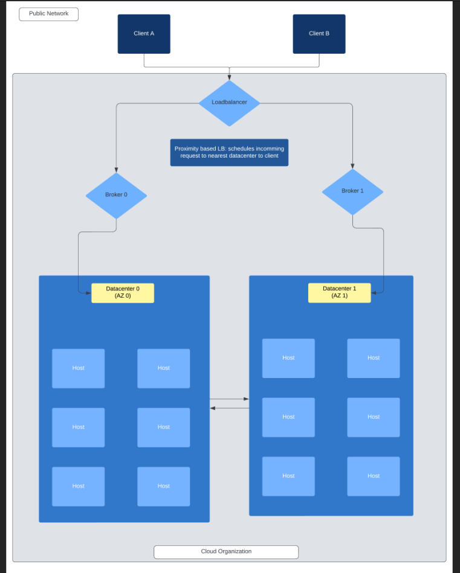
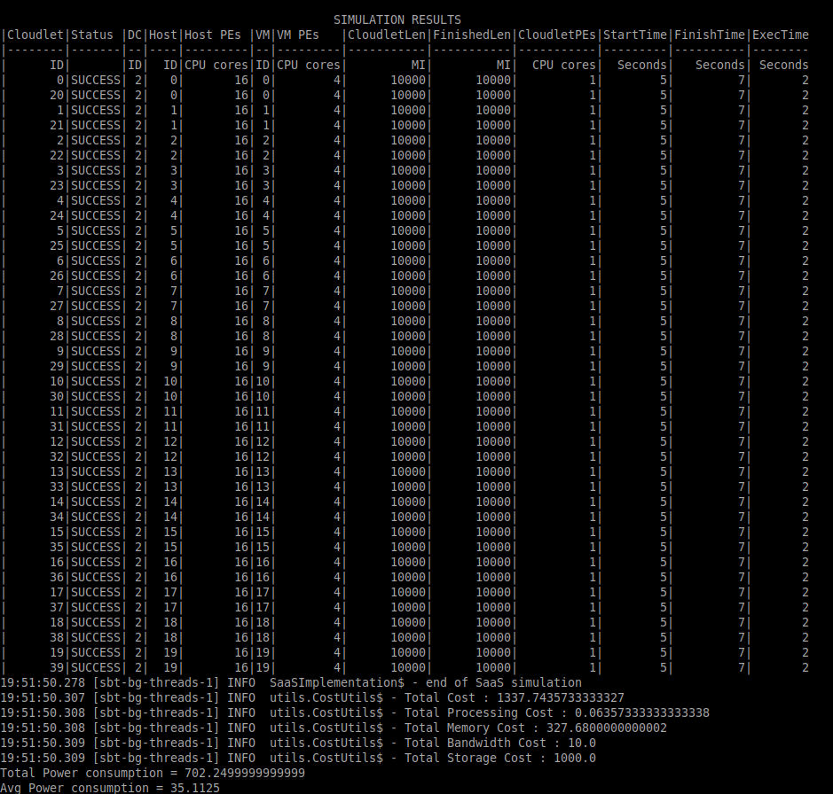
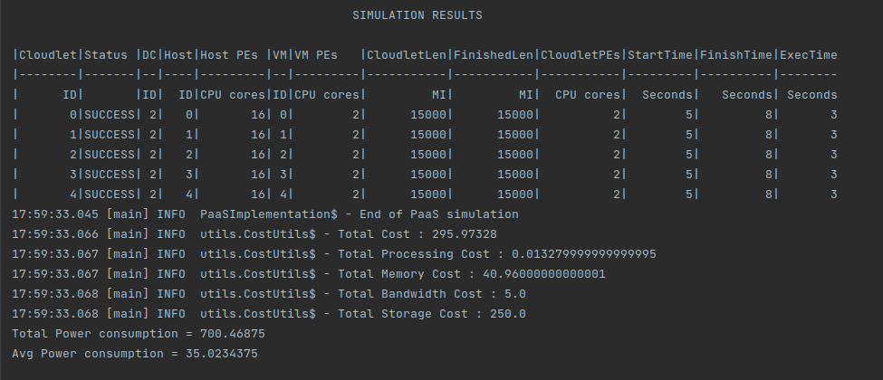
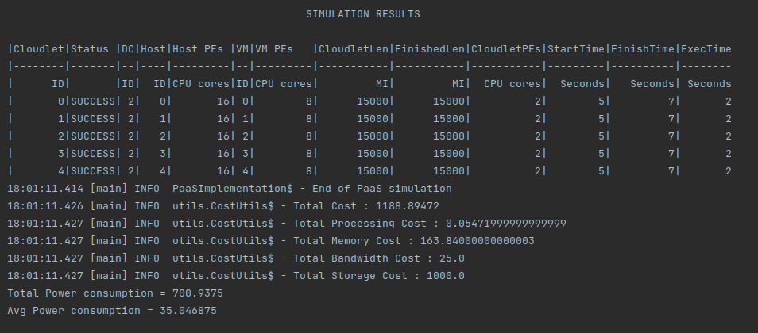
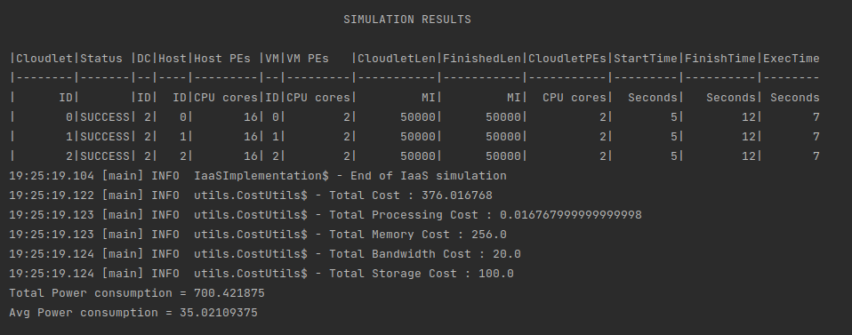
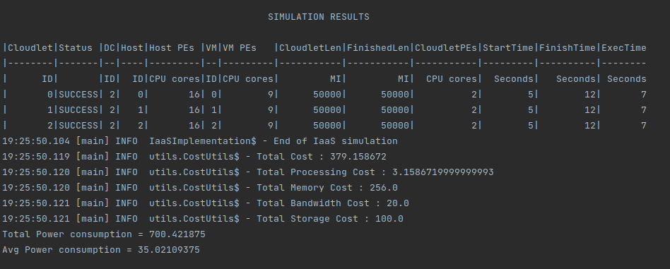

# CloudSimulator - Yash Pharande

A CloudDatacenter Simulation which can be used as a tool for benchmarking various cloud datacenter implementation and workloads

# Features
* Allows for easy configuration of cloud datacenter architecture and modeling of workloads(no coding required from the user!!!)
* Defines different levels of access control in the form of cloud computing models ie SaaS, PaaS, IaaS etc
* Offers high degree of customization of various parameters :
    * **VmAllocationPolicies** - Best Fit / First Fit / Round Robin
    * **VmScheduling** - Time Shared / Space Shared
    * **CloudletteScheduling** - Time Shared / Space Shared
    * **ClourletteResourceUtilization Modes**
    * **VmAutoscaling** - Horizontal / Vertical
    * **NetworkTopology**
    * **PowerConsumption Modeling**
    * **Cost Modeling**

# Prerequisites
This projects uses the following libraries:
- Java 17
- SBT
- CloudSimPlus (V7.3.0)
- Slf4j and Logback
- Scalatest Framework
- typesafeConfig

# Architecture


# How to Run
To run this project:

1. Compile and Start Server
```
sbt clean compile run
```
- Then select the appropriate simulation as per requirement

# Configuration options available to a CloudUser

Userspace configurations are found in Override.conf file

### SaaS Implementation
```

*User is allowed to only select from predefined Applications(Cloudlets) and their number

SaaS{
    #set cloudlet application type A or B
    cloudlet_type = A

    #Set Number of Cloudlets (1-40)
    cloudlet_count = 40
}

```
User cannot configure the software applicaiton parameters nor Virtual Machines and its parameters

### PaaS Implementation
```

*User has access to choose from list of pre-configured VMs 
*User can also simulate their own application behavior
 
PaaS{

    #user can select configured VM type (SMALL,MEDIUM,LARGE)
    vmType = LARGE

    #user can choose number of VM instances
    vmCount = 10


    #user application parameters
    application{

            #min resource utilization 
            minUtil = 0.5
            
            #max resource utilization
            maxUtil = 0.9

            # lenght(in Mips) of each application
            length = 15000
            
            #number of Processing elements required
            peCount = 2
            
            #total number of instances
            application_count = 5

            #Allows applications to be submitted with random delay to simulate real world scenario
            #TRUE or FALSE
            EnableSubmissionDelay=TRUE

        }
}

```
User cannot configure the VM attributes and are limited to chosing from pre-defined options from CloudProvider

### IaaS Implementation
```
 
*User can simulate their own application behavior
*User can describe custom VM by changing the params along with Cloudlet schedulling policies 

 
IaaS{
        #configure vm 
        VM{
                #Ram in MB (max = 32000)
                ram = 30000

                #Storage in MB (max = 2048000)
                storage = 250000

                #BW in Mb (max = 10000)
                bw = 10000

                #MIPS capacity of each host pe (max = 50000)
                mipsCapacity = 15000

                #Num of PEs (max 16)
                peCount = 2

                #Num of Vms
                vmCount = 2

                #Scheduler ( FAIR, SPACESHARED, TIMESHARED)
                scheduler=TIMESHARED

        }
        
        #describe application behaviour parameter
        application{

                    minUtil = 0.7

                    maxUtil = 0.9

                    length = 1500000

                    peCount = 2

                    application_count = 2

                    #TRUE or FALSE
                    EnableSubmissionDelay=FALSE

                }

        #describe autoscaling behaviour
        autoScaling{

               #enables vertical autoscaling for cpu
               enabled = "TRUE"

               #set lower threshold 
               loweUtilThreshold = 0.3
                
               #set upper threshold 
               upperUtilThreshold = 0.7

           }

}

```
User dosenot have access to change VMAllocation, VMMigration and Scheduling parameters the cloud org retains control over it

### MultiDataCenter Implementation for complex Diffuse Computation Cloudlettes
```
MultiDatacenter{
    clientA{
        # 0 = closer to Datacenter0 or 1 = closer to Datacenter1
        proximity = 0

        #diffuse computation job params
        #number of jobs
        count = 15

        #lenght of job
        lenght = 1000

        #pe requirement
        peRequired = 2
    }

    clientB{
            # 0 = closer to Datacenter0 or 1 = closer to Datacenter1
            proximity = 1

            #diffuse computation job params
            #number of jobs
            count = 10

            #lenght of job
            lenght = 2000

            #pe requirement
            peRequired = 2
        }


    #To change vm parameters modify the IaaS.VM config within this document
}
```
# Configuration options available to a CloudOrg

Orgspace configurations are found in Default.conf file

## Datacenter Parameters

```
dataCenterConfig {

    #VMAllocationPolicy "BESTFIT"/"FIRSTFIT"/"ROUNDROBIN"/"SIMPLE"
    allocationPolicy = "SIMPLE"

    #Number of Hosts
    hostCount = 20

    #Scheduling Interval
    interval = 1

}
```

## Host Parameters

```
hostConfig {

    #Ram in MB (32 GB) per host
    ram = 32000
    ramCost = 0.002
    
    #Storage in MB (2 TB) per host
    storage = 2048000
    storageCost = 0.0001
    
    #Bandwidth in Mb (10 Gbps) per host
    bw = 10000

    # Bandwidth cost per Mb
    bwCost = 0.0005
    
    #MIPS capacity of each host Processor
    mipsCapacity = 50000

    #Num of Processors
    peCount = 16
    
    #Execution cost per seccond
    costPerSec = 0.001

    #power consumption parameters
    #Startup Delay in sec
    startupDelay = 5.0

    #Shutdown Delay  in secs
    shutdownDelay = 3.0

    #all units in Watts
    startupPower = 5.0
    shutdownPower = 3.0
    staticPower = 35.0
    maxPower = 50.0

    #VM Scheduling policy ("TIME" for timeshared or "SPACE" for spaceshared)
    vmScheduler = "SPACE"
}
```

## NetworkTopology Parameters

```
NetworkTopology{
    # in Mbps
    bandwidth{
            #broker0 and datacenter0
            brokerDatacenter0 = 100.0

            #broker1 and datacenter1
            brokerDatacenter1 = 110.0

            #datacenter1 and datacenter0
            datacenters = 500.0
    }


    #in secs
    latency{
            #broker0 and datacenter0
            brokerDatacenter0 = 3.0

            #broker1 and datacenter1
            brokerDatacenter1 = 6.0

            #datacenter1 and datacenter0
            datacenters = 15.0
    }
```

### PaaS VM parameters

```
VMConfig {

    Small {
        #Ram in MB (4 GB)
        ram = 2048

        #Storage in MB (256 GB)
        storage = 250000

        #BW in Mb (100 Mbps)
        bw = 1000

        #MIPS capacity of each host
        mipsCapacity = 10000

        #Num of PEs
        peCount = 2
    }

    Med {
            #Ram in MB (8 GB)
            ram = 8192

            #Storage in MB (512 GB)
            storage = 500000

            #BW in Mb (100 Mbps)
            bw = 1000

            #MIPS capacity of each host
            mipsCapacity = 20000

            #Num of PEs
            peCount = 4
        }

   Large{
           #Ram in MB (16 GB)
           ram = 16000

           #Storage in MB (1 TB)
           storage = 1000000

           #BW in Mb (1 Gbps)
           bw = 5000

           #MIPS capacity of each host
           mipsCapacity = 20000

           #Num of PEs
           peCount = 8
       }

}
```

### SaaS Configuration Parameters

```
CloudletConfig{

    #utilization parameters of application A
    applicationA {
        
        #resource utilization params
        minUtil = 0.3
        maxUtil = 1.0
        
        #in Mips
        length = 10000

        #required no. of processors
        peCount = 1

    }

    #utilization parameters of application B
    applicationB{

        #resource utilization params
        minUtil = 0.5
        maxUtil = 0.9

        #in Mips
        length = 15000

        #required no. of processors
        peCount = 2

    }

}
```


# Few Output Examples
## SaaS implementation
### Scheduling 40 instances of App A 


## PaaS implementation 

### VM Selected - SMALL

# vs
### VM Selected - LARGE


#### *Notice the tradeoff between Cost and Execution time*

## IaaS Implementation 

### Vertical CPU AutoScaling Disabled

# VS
### Vertical CPU AutoScaling Enabled


#### *Notice even when 9 cpu cores were assigned ExecTime did not change indicating Bottleneck of other resourecs RAM, Bandwidth*

```
Users can change the various parameters and run their own simulation.
However certain combinations will lead in simulation failing 
For eg - trying to create vms which exceed the host resources that are available, 
improper configuration of allocation policy or VmScheduler along with autoscaling etc
```

### MultiDatacenter Implementation with Network Topology

```
01:48:57.410 [main] INFO  MultiDatacenterImplementation$ - MultiDatacenterImplementation Datacenter0 : 


                                               SIMULATION RESULTS

|Cloudlet|Status |DC|Host|Host PEs |VM|VM PEs   |CloudletLen|FinishedLen|CloudletPEs|StartTime|FinishTime|ExecTime
|--------|-------|--|----|---------|--|---------|-----------|-----------|-----------|---------|----------|--------
|      ID|       |ID|  ID|CPU cores|ID|CPU cores|         MI|         MI|  CPU cores|  Seconds|   Seconds| Seconds
|       0|SUCCESS| 4|   0|       16| 0|        2|       5000|       5000|          2|       61|        63|       2
|       1|SUCCESS| 4|   1|       16| 1|        2|       5000|       5000|          2|       61|        63|       2
|       2|SUCCESS| 4|   2|       16| 2|        2|       5000|       5000|          2|       61|        63|       2
|       3|SUCCESS| 4|   3|       16| 3|        2|       5000|       5000|          2|       61|        63|       2
|       4|SUCCESS| 4|   0|       16| 0|        2|       5000|       5000|          2|       63|        65|       2
|       5|SUCCESS| 4|   1|       16| 1|        2|       5000|       5000|          2|       63|        65|       2
|       6|SUCCESS| 4|   2|       16| 2|        2|       5000|       5000|          2|       63|        65|       2
|       7|SUCCESS| 4|   3|       16| 3|        2|       5000|       5000|          2|       63|        65|       2
|       8|SUCCESS| 4|   0|       16| 0|        2|       5000|       5000|          2|       65|        66|       2
|       9|SUCCESS| 4|   1|       16| 1|        2|       5000|       5000|          2|       65|        66|       2
|      10|SUCCESS| 4|   2|       16| 2|        2|       5000|       5000|          2|       65|        66|       2
|      11|SUCCESS| 4|   3|       16| 3|        2|       5000|       5000|          2|       65|        66|       2
|      12|SUCCESS| 4|   0|       16| 0|        2|       5000|       5000|          2|       67|        68|       2
|      13|SUCCESS| 4|   1|       16| 1|        2|       5000|       5000|          2|       67|        68|       2
|      14|SUCCESS| 4|   2|       16| 2|        2|       5000|       5000|          2|       67|        68|       2
|      15|SUCCESS| 4|   3|       16| 3|        2|       5000|       5000|          2|       67|        68|       2
|      17|SUCCESS| 4|   1|       16| 1|        2|        178|        178|          2|       88|        88|       0
|      16|SUCCESS| 4|   0|       16| 0|        2|        151|        151|          2|       93|        93|       0
|      18|SUCCESS| 4|   2|       16| 2|        2|        131|        131|          2|       98|        98|       0
|      26|SUCCESS| 4|   2|       16| 2|        2|        128|        128|          2|       99|        99|       0
|      19|SUCCESS| 4|   3|       16| 3|        2|        128|        128|          2|       99|        99|       0
|      21|SUCCESS| 4|   1|       16| 1|        2|        125|        125|          2|      100|       100|       0
|      23|SUCCESS| 4|   3|       16| 3|        2|        125|        125|          2|      100|       100|       0
|      29|SUCCESS| 4|   1|       16| 1|        2|        119|        119|          2|      102|       102|       0
|      30|SUCCESS| 4|   2|       16| 2|        2|        119|        119|          2|      102|       102|       0
|      22|SUCCESS| 4|   2|       16| 2|        2|        116|        116|          2|      103|       103|       0
|      20|SUCCESS| 4|   0|       16| 0|        2|        113|        113|          2|      104|       104|       0
|      32|SUCCESS| 4|   0|       16| 0|        2|        113|        113|          2|      104|       105|       0
|      24|SUCCESS| 4|   0|       16| 0|        2|        108|        108|          2|      106|       106|       0
|      25|SUCCESS| 4|   1|       16| 1|        2|        108|        108|          2|      106|       106|       0
|      27|SUCCESS| 4|   3|       16| 3|        2|        108|        108|          2|      106|       106|       0
|      28|SUCCESS| 4|   0|       16| 0|        2|        102|        102|          2|      109|       109|       0
|      38|SUCCESS| 4|   2|       16| 2|        2|        102|        102|          2|      109|       109|       0
|      31|SUCCESS| 4|   3|       16| 3|        2|        102|        102|          2|      109|       109|       0
|      36|SUCCESS| 4|   0|       16| 0|        2|         98|         98|          2|      111|       111|       0
|      40|SUCCESS| 4|   0|       16| 0|        2|         94|         94|          2|      113|       113|       0
|      33|SUCCESS| 4|   1|       16| 1|        2|         94|         94|          2|      113|       113|       0
|      34|SUCCESS| 4|   2|       16| 2|        2|         94|         94|          2|      113|       113|       0
|      43|SUCCESS| 4|   3|       16| 3|        2|         92|         92|          2|      114|       114|       0
|      41|SUCCESS| 4|   1|       16| 1|        2|         90|         90|          2|      115|       115|       0
|      39|SUCCESS| 4|   3|       16| 3|        2|         90|         90|          2|      115|       115|       0
|      42|SUCCESS| 4|   2|       16| 2|        2|         87|         87|          2|      117|       117|       0
|      48|SUCCESS| 4|   0|       16| 0|        2|         86|         86|          2|      118|       118|       0
|      45|SUCCESS| 4|   1|       16| 1|        2|         86|         86|          2|      118|       118|       0
|      37|SUCCESS| 4|   1|       16| 1|        2|         84|         84|          2|      119|       119|       0
|      35|SUCCESS| 4|   3|       16| 3|        2|         84|         84|          2|      119|       119|       0
|      44|SUCCESS| 4|   0|       16| 0|        2|         83|         83|          2|      120|       120|       0
|      52|SUCCESS| 4|   0|       16| 0|        2|         79|         79|          2|      123|       123|       0
|      46|SUCCESS| 4|   2|       16| 2|        2|         79|         79|          2|      123|       123|       0
|      47|SUCCESS| 4|   3|       16| 3|        2|         79|         79|          2|      123|       123|       0
|      50|SUCCESS| 4|   2|       16| 2|        2|         78|         78|          2|      124|       124|       0
|      55|SUCCESS| 4|   3|       16| 3|        2|         76|         76|          2|      125|       125|       0
|      56|SUCCESS| 4|   0|       16| 0|        2|         73|         73|          2|      128|       128|       0
|      49|SUCCESS| 4|   1|       16| 1|        2|         69|         69|          2|      132|       132|       0
|      53|SUCCESS| 4|   1|       16| 1|        2|         69|         69|          2|      132|       133|       0
|      57|SUCCESS| 4|   1|       16| 1|        2|         67|         67|          2|      134|       134|       0
|      59|SUCCESS| 4|   3|       16| 3|        2|         67|         67|          2|      134|       134|       0
|      54|SUCCESS| 4|   2|       16| 2|        2|         66|         66|          2|      135|       135|       0
|      51|SUCCESS| 4|   3|       16| 3|        2|         66|         66|          2|      135|       135|       0
|      61|SUCCESS| 4|   1|       16| 1|        2|         65|         65|          2|      136|       136|       0
|      62|SUCCESS| 4|   2|       16| 2|        2|         64|         64|          2|      138|       138|       0
|      64|SUCCESS| 4|   0|       16| 0|        2|         61|         61|          2|      141|       141|       0
|      58|SUCCESS| 4|   2|       16| 2|        2|         61|         61|          2|      141|       141|       0
|      66|SUCCESS| 4|   2|       16| 2|        2|         61|         61|          2|      141|       142|       0
|      60|SUCCESS| 4|   0|       16| 0|        2|         60|         60|          2|      143|       143|       0
|      71|SUCCESS| 4|   3|       16| 3|        2|         60|         60|          2|      143|       143|       0
|      70|SUCCESS| 4|   2|       16| 2|        2|         58|         58|          2|      145|       145|       0
|      69|SUCCESS| 4|   1|       16| 1|        2|         58|         58|          2|      146|       146|       0
|      65|SUCCESS| 4|   1|       16| 1|        2|         57|         57|          2|      147|       147|       0
|      63|SUCCESS| 4|   3|       16| 3|        2|         57|         57|          2|      147|       147|       0
|      73|SUCCESS| 4|   1|       16| 1|        2|         56|         56|          2|      149|       149|       0
|      67|SUCCESS| 4|   3|       16| 3|        2|         55|         55|          2|      150|       150|       0
|      68|SUCCESS| 4|   0|       16| 0|        2|         54|         54|          2|      152|       152|       0
|      72|SUCCESS| 4|   0|       16| 0|        2|         54|         54|          2|      152|       153|       0
|      74|SUCCESS| 4|   2|       16| 2|        2|         52|         52|          2|      156|       156|       0
01:48:57.466 [main] INFO  utils.CostUtils$ - Total Cost : 376.36077632
01:48:57.467 [main] INFO  utils.CostUtils$ - Total Processing Cost : 0.3607763200000001
01:48:57.468 [main] INFO  utils.CostUtils$ - Total Memory Cost : 256.0
01:48:57.469 [main] INFO  utils.CostUtils$ - Total Bandwidth Cost : 20.0
01:48:57.470 [main] INFO  utils.CostUtils$ - Total Storage Cost : 100.0
Total Power consumption = 700.0682722001638
Avg Power consumption = 35.003413610008195
01:48:57.476 [main] INFO  MultiDatacenterImplementation$ - MultiDatacenterImplementation Datacenter1 : 


                                               SIMULATION RESULTS

|Cloudlet|Status |DC|Host|Host PEs |VM|VM PEs   |CloudletLen|FinishedLen|CloudletPEs|StartTime|FinishTime|ExecTime
|--------|-------|--|----|---------|--|---------|-----------|-----------|-----------|---------|----------|--------
|      ID|       |ID|  ID|CPU cores|ID|CPU cores|         MI|         MI|  CPU cores|  Seconds|   Seconds| Seconds
|       0|SUCCESS| 3|   0|       16| 0|        2|      10000|      10000|          2|       64|        67|       3
|       1|SUCCESS| 3|   1|       16| 1|        2|      10000|      10000|          2|       64|        67|       3
|       2|SUCCESS| 3|   2|       16| 2|        2|      10000|      10000|          2|       64|        67|       3
|       3|SUCCESS| 3|   3|       16| 3|        2|      10000|      10000|          2|       64|        67|       3
|       4|SUCCESS| 3|   0|       16| 0|        2|      10000|      10000|          2|       68|        70|       3
|       5|SUCCESS| 3|   1|       16| 1|        2|      10000|      10000|          2|       68|        70|       3
|       6|SUCCESS| 3|   2|       16| 2|        2|      10000|      10000|          2|       68|        70|       3
|       7|SUCCESS| 3|   3|       16| 3|        2|      10000|      10000|          2|       68|        70|       3
|       8|SUCCESS| 3|   0|       16| 0|        2|      10000|      10000|          2|       71|        74|       3
|       9|SUCCESS| 3|   1|       16| 1|        2|      10000|      10000|          2|       71|        74|       3
|      10|SUCCESS| 3|   2|       16| 2|        2|      10000|      10000|          2|       71|        74|       3
|      11|SUCCESS| 3|   3|       16| 3|        2|        416|        416|          2|       87|        87|       0
|      15|SUCCESS| 3|   3|       16| 3|        2|        400|        400|          2|       88|        88|       0
|      14|SUCCESS| 3|   2|       16| 2|        2|        384|        384|          2|       89|        89|       0
|      13|SUCCESS| 3|   1|       16| 1|        2|        344|        344|          2|       92|        92|       0
|      16|SUCCESS| 3|   0|       16| 0|        2|        322|        322|          2|       94|        94|       0
|      18|SUCCESS| 3|   2|       16| 2|        2|        294|        294|          2|       97|        97|       0
|      24|SUCCESS| 3|   0|       16| 0|        2|        285|        285|          2|       98|        98|       0
|      12|SUCCESS| 3|   0|       16| 0|        2|        277|        277|          2|       99|        99|       0
|      17|SUCCESS| 3|   1|       16| 1|        2|        270|        270|          2|      100|       100|       0
|      28|SUCCESS| 3|   0|       16| 0|        2|        238|        238|          2|      105|       105|       0
|      22|SUCCESS| 3|   2|       16| 2|        2|        238|        238|          2|      105|       105|       0
|      19|SUCCESS| 3|   3|       16| 3|        2|        238|        238|          2|      105|       105|       0
|      23|SUCCESS| 3|   3|       16| 3|        2|        238|        238|          2|      105|       105|       0
|      20|SUCCESS| 3|   0|       16| 0|        2|        232|        232|          2|      106|       106|       0
|      21|SUCCESS| 3|   1|       16| 1|        2|        227|        227|          2|      107|       107|       0
|      30|SUCCESS| 3|   2|       16| 2|        2|        227|        227|          2|      107|       107|       0
|      29|SUCCESS| 3|   1|       16| 1|        2|        227|        227|          2|      107|       107|       0
|      25|SUCCESS| 3|   1|       16| 1|        2|        222|        222|          2|      108|       108|       0
|      31|SUCCESS| 3|   3|       16| 3|        2|        217|        217|          2|      109|       109|       0
|      26|SUCCESS| 3|   2|       16| 2|        2|        212|        212|          2|      110|       110|       0
|      35|SUCCESS| 3|   3|       16| 3|        2|        212|        212|          2|      110|       110|       0
|      27|SUCCESS| 3|   3|       16| 3|        2|        208|        208|          2|      111|       111|       0
|      33|SUCCESS| 3|   1|       16| 1|        2|        204|        204|          2|      112|       112|       0
|      32|SUCCESS| 3|   0|       16| 0|        2|        196|        196|          2|      114|       114|       0
|      38|SUCCESS| 3|   2|       16| 2|        2|        196|        196|          2|      114|       114|       0
|      37|SUCCESS| 3|   1|       16| 1|        2|        192|        192|          2|      115|       115|       0
|      34|SUCCESS| 3|   2|       16| 2|        2|        192|        192|          2|      115|       115|       0
|      42|SUCCESS| 3|   2|       16| 2|        2|        192|        192|          2|      115|       115|       0
|      36|SUCCESS| 3|   0|       16| 0|        2|        188|        188|          2|      116|       116|       0
|      41|SUCCESS| 3|   1|       16| 1|        2|        175|        175|          2|      120|       120|       0
|      39|SUCCESS| 3|   3|       16| 3|        2|        175|        175|          2|      120|       120|       0
|      43|SUCCESS| 3|   3|       16| 3|        2|        175|        175|          2|      120|       120|       0
|      40|SUCCESS| 3|   0|       16| 0|        2|        163|        163|          2|      124|       124|       0
|      45|SUCCESS| 3|   1|       16| 1|        2|        156|        156|          2|      127|       127|       0
|      47|SUCCESS| 3|   3|       16| 3|        2|        156|        156|          2|      127|       127|       0
|      48|SUCCESS| 3|   0|       16| 0|        2|        149|        149|          2|      130|       130|       0
|      46|SUCCESS| 3|   2|       16| 2|        2|        149|        149|          2|      130|       130|       0
|      44|SUCCESS| 3|   0|       16| 0|        2|        147|        147|          2|      131|       131|       0
|      49|SUCCESS| 3|   1|       16| 1|        2|        136|        136|          2|      136|       136|       0
01:48:57.495 [main] INFO  utils.CostUtils$ - Total Cost : 376.41861632
01:48:57.495 [main] INFO  utils.CostUtils$ - Total Processing Cost : 0.4186163200000001
01:48:57.495 [main] INFO  utils.CostUtils$ - Total Memory Cost : 256.0
01:48:57.495 [main] INFO  utils.CostUtils$ - Total Bandwidth Cost : 20.0
01:48:57.495 [main] INFO  utils.CostUtils$ - Total Storage Cost : 100.0
Total Power consumption = 700.0794205166637
Avg Power consumption = 35.00397102583319

```

Note: Autoscaling if not configured correctly will cause runtime exceptions